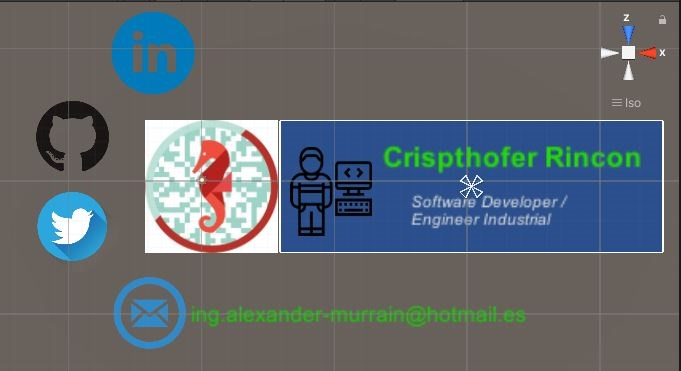

# 0x09. Unity - AR Business Card

## Background Context

For AR projects, we will be utilizing a few different SDKs, starting with Vuforia. As of Unity 2017.2, Vuforia is integrated into Unity and supports development for iOS, Android, and Windows.

## Resources
#### Read or watch:

<ul>
    <li><a href="/rltoken/R87wTBzq_6qJtY7nuUyPXg" title="Getting Started with Vuforia Engine in Unity" target="_blank">Getting Started with Vuforia Engine in Unity</a> </li>
    <li><a href="/rltoken/LLqElV5TCjwIXFu5dx46fA" title="Optimizing Target Detection and Tracking Stability" target="_blank">Optimizing Target Detection and Tracking Stability</a> </li>
    <li><a href="/rltoken/EjFTYi93sB7P67esU_cr8A" title="Unity: World Space Canvas" target="_blank">Unity: World Space Canvas</a></li>
    <li><a href="/rltoken/bBt7jPj7iJ-9hDRba5yoXw" title="Unity Manual" target="_blank">Unity Manual</a> </li>
    <li><a href="/rltoken/NIJxmeLZh9_RLoK3CVLNqw" title="Vuforia: Unity API Reference" target="_blank">Vuforia: Unity API Reference</a> </li>
    <li><a href="/rltoken/1Mco5Mo4mUP7oV-JjP74qQ" title="UI / UX in AR / VR" target="_blank">UI / UX in AR / VR</a></li>
</ul>

## Learning Objectives

## General
<ul>
    <li>What is Vuforia and what are its advantages and disadvantages</li>
    <li>What is marker-based augmented reality</li>
    <li>How to choose or create images optimized for target detection</li>
    <li>How to track an image using Vuforia</li>
    <li>How to publish applications for both Android and iOS with Vuforia</li>
    <li>How to design for an augmented reality environment</li>
</ul>

# Requirements
## General
<ul>
    <li>A <code>README.md</code> file, at the root of the folder of the project</li>
    <li>Use Unity’s default <code>.gitignore</code> in your <code>holbertonschool-unity</code> directory</li>
    <li>Push the entire project folder <code>0x09-unity-ar_business_card</code> to your repo</li>
    <li>Scenes and project assets such as Scripts must be organized as described in the tasks</li>
    <li>In your scripts, all your public classes and their members should have XML documentation tags</li>
    <li>In your scripts, all your private classes and members should be documented but without XML documentation tags</li>
</ul>

# How use the AR Business Card

## Download Platformer Game for iOS and Android platform
#### 1) Download the file according your device.
📱 [Download](https://drive.google.com/drive/folders/1tOvSinIVvARRl72TzAn1FSROz3aiSxD3?usp=sharing)
#### 2) Decompress the file and install the APK. If you have some issues about permissions or securities give to accept the alert, don't worry. Later, you can uninstall it

## Image to test AR Business Card

#### AR Business Card Layout

* Touch the Social media links and enjoy
 

#### Follow me 💬

| Authors | GitHub | Twitter | Linkedin |
| :---: | :---: | :---: | :---: |
| Crispthofer Rincon | [crispthoalex](https://github.com/crispthoalex) | [@crispthoalex](https://twitter.com/crispthoalex) | [carmurrain](https://www.linkedin.com/in/carmurrain) |

### License
*`0x09. Unity - AR Business Card` is open source and therefore free to download and use without permission.*

##### Holberton School – Advanced Program – AR/VR
##### May, 2021. Cali, Colombia
