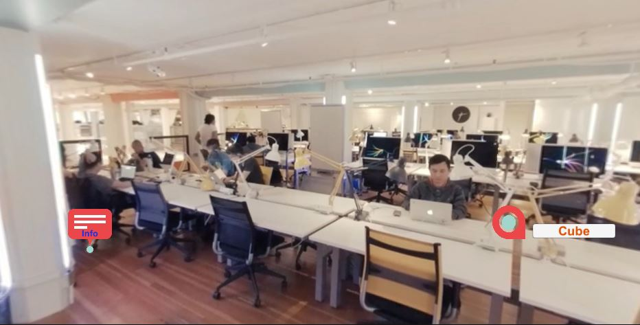

# 0x0A. Unity - 360 Video
#### Creating VR experiences

## Learn
<ul>
<li><a href="/rltoken/ypdjLWVfD1OEB6ywu6LlWQ" title="Introduction to Positional Tracking and Degrees of Freedom" target="_blank">Introduction to Positional Tracking and Degrees of Freedom</a></li>
<li><a href="/rltoken/mDQxLe3Cdyr8c4MQ15mSew" title="Introduction to 360-degree video and virtual reality" target="_blank">Introduction to 360-degree video and virtual reality</a></li>
<li><a href="/rltoken/cTses2PrhwALscqzUDOnPQ" title="Getting started in interactive 360 video" target="_blank">Getting started in interactive 360 video</a></li>
<li><a href="/rltoken/wIZ0rVubAWlVSi0PtNuykQ" title="Interaction in VR" target="_blank">Interaction in VR</a></li>
<li><a href="/rltoken/keZ3rWzf2VxoFf3YyS27sg" title="Stereo vs Mono 360 Video" target="_blank">Stereo vs Mono 360 Video</a></li>
<li><a href="/rltoken/uMVQFDqyz4M5WrU1MYzrRw" title="Unity Manual" target="_blank">Unity Manual</a></li>
<li><a href="/rltoken/nLCFPDrK9OXhEpd3rASwrg" title="Motion Sickness in VR" target="_blank">Motion Sickness in VR</a></li>
<li><a href="/rltoken/rnW8JzO5cDELLblKL8586Q" title="The UX of VR" target="_blank">The UX of VR</a></li>
</ul>

<h2>What you should learn</h2>
<ul>
<li>What is 3DOF vs 6DOF</li>
<li>What VR headsets are on the current market and how to target them</li>
<li>What is 360 video and what are its potential use cases</li>
<li>What is the difference between monoscopic and stereoscopic 360 video</li>
<li>What are render textures </li>
<li>How to use Unity’s Video Player component</li>
</ul>

<h2>Requirements for Unity projects</h2>
<ul>
<li>A <code>README.md</code> file, at the root of the folder of the project</li>
<li>Use Unity’s default <code>.gitignore</code> in your <code>0x0A-unity-360_video_tour</code> directory</li>
<li><strong>This project should be uploaded to its own repo named</strong> <code>0x0A-unity-360_video_tour</code></li>
<li>Scenes and project assets such as Scripts must be organized as described in the tasks</li>
<li>In your scripts, all your public classes and their members should have XML documentation tags</li>
<li>In your scripts, all your private classes and members should be documented but without XML documentation tags</li>
</ul>

### Details
This project was developed with Unity vers. 2019.4.26f1 for the Google Cardboard device using Android Platform.

#### Settings for this project
https://developers.google.com/cardboard/develop/unity/quickstart

#### Credits
* Audio
Heroism by MaxKoMusic | [https://maxkomusic.com/](https://maxkomusic.com/)
Music promoted by [https://www.chosic.com](https://www.chosic.com)
Creative Commons Attribution-ShareAlike 3.0 Unported
[https://creativecommons.org/licenses/by-sa/3.0/deed.en_US](https://creativecommons.org/licenses/by-sa/3.0/deed.en_US)

#### Follow me 💬

| Authors | GitHub | Twitter | Linkedin |
| :---: | :---: | :---: | :---: |
| Crispthofer Rincon | [crispthoalex](https://github.com/crispthoalex) | [@crispthoalex](https://twitter.com/crispthoalex) | [carmurrain](https://www.linkedin.com/in/carmurrain) |

### License
*`0x0A. Unity - 360 Video` is open source and therefore free to download and use without permission.*

##### Holberton School – Advanced Program – AR/VR
##### May, 2021. Cali, Colombia