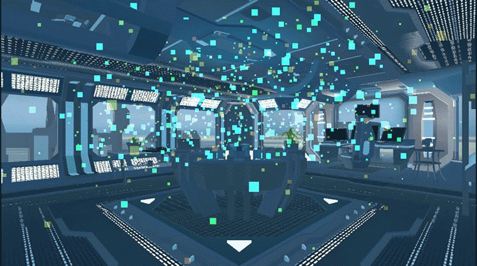

# 0x0B. Unity - VR Room

# Read

<ul>
    <li><a href="/rltoken/YdNvEvfqIg3vl8quIcFknQ" title="The Science of Locomotion in VR" target="_blank">The Science of Locomotion in VR</a></li>
    <li><a href="/rltoken/giLL3MUvQZHurgxXBsISIw" title="Movement in VR" target="_blank">Movement in VR</a></li>
    <li><a href="/rltoken/RRT5YnnIVUa1qgrhN54i9w" title="Game Design Deep Dive: Making VR movement feel like a superpower" target="_blank">Game Design Deep Dive: Making VR movement feel like a superpower</a></li>
    <li><a href="/rltoken/3dgGkhOpeIWzGxyiD-f99g" title="Why AR/VR developers should prioritize accessibility in UI / UX Design" target="_blank">Why AR/VR developers should prioritize accessibility in UI / UX Design</a></li>
    <li><a href="/rltoken/giLL3MUvQZHurgxXBsISIw" title="Unity Manual: Introduction to VR Best Practices" target="_blank">Unity Manual: Introduction to VR Best Practices</a> - Read all sections (“Rendering in VR”, “Motion-to-Photon Latency”, “Mobile Considerations”, and “Platform Specific Recommendations”)</li>
    <li><a href="/rltoken/myVNumTBNdaELusr2aX7wg" title="Unity Manual: Understanding optimization in Unity" target="_blank">Unity Manual: Understanding optimization in Unity</a></li>
    <li><a href="/rltoken/f5uIiatxuix1bNdbOOK29A" title="Unity Manual" target="_blank">Unity Manual</a></li>
    <li><a href="/rltoken/rGr06dpEc-eDla51OqPgaA" title="UI / UX in AR / VR" target="_blank">UI / UX in AR / VR</a></li>
</ul>

<h2>What you should learn</h2>

<ul>
    <li>What are the different types of locomotion / movement in VR</li>
    <li>What causes VR motion sickness</li>
    <li>What are the different methods of minimizing VR motion sickness in locomotion implementations</li>
    <li>How to implement a teleportation method of movement in VR</li>
    <li>How to implement interactive objects in VR</li>
</ul>

<h2>Requirements for Unity projects</h2>

<ul>
    <li>A <code>README.md</code> file, at the root of the folder of the project</li>
    <li>Use Unity’s default <code>.gitignore</code> in your <code>0x0B-unity-vr_room</code> directory</li>
    <li><strong>This project should be uploaded to its own repo named</strong> <code>0x0B-unity-vr_room</code></li>
    <li>Scenes and project assets such as Scripts must be organized as described in the tasks</li>
    <li>In your scripts, all your public classes and their members should have XML documentation tags</li>
    <li>In your scripts, all your private classes and members should be documented but without XML documentation tags</li>
</ul>

#### Follow me 💬

| Authors | GitHub | Twitter | Linkedin |
| :---: | :---: | :---: | :---: |
| Crispthofer Rincon | [crispthoalex](https://github.com/crispthoalex) | [@crispthoalex](https://twitter.com/crispthoalex) | [carmurrain](https://www.linkedin.com/in/carmurrain) |

### License
*`0x0B. Unity - VR Room` is open source and therefore free to download and use without permission.*

##### Holberton School – Advanced Program – AR/VR
##### Jule, 2021. Cali, Colombia
