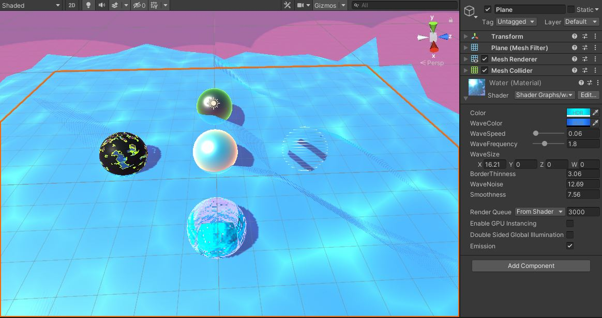
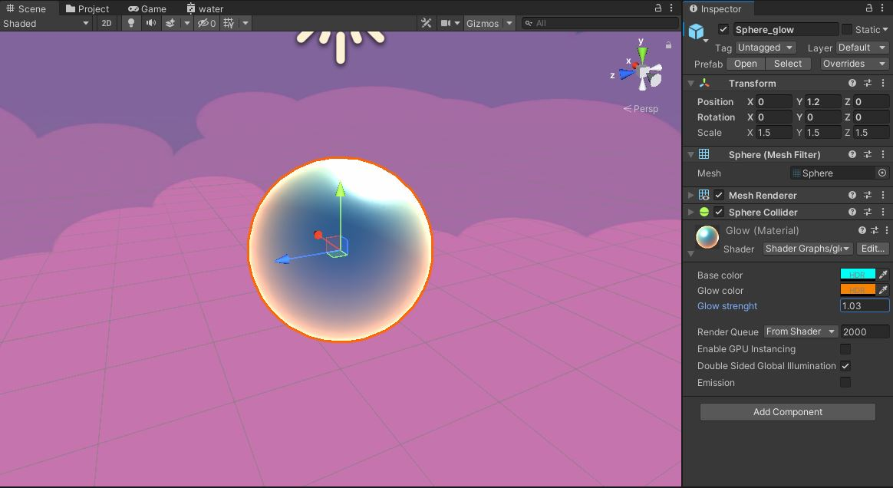
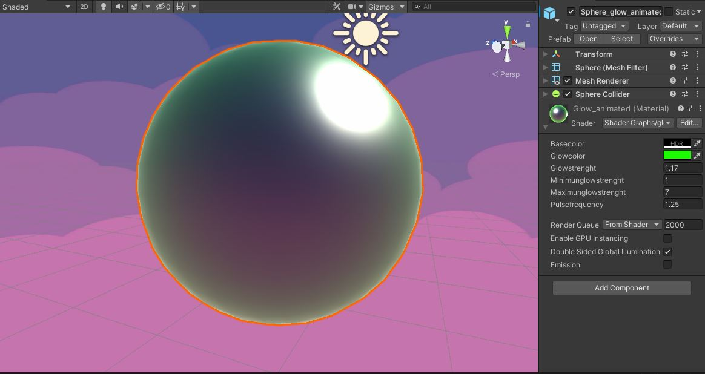
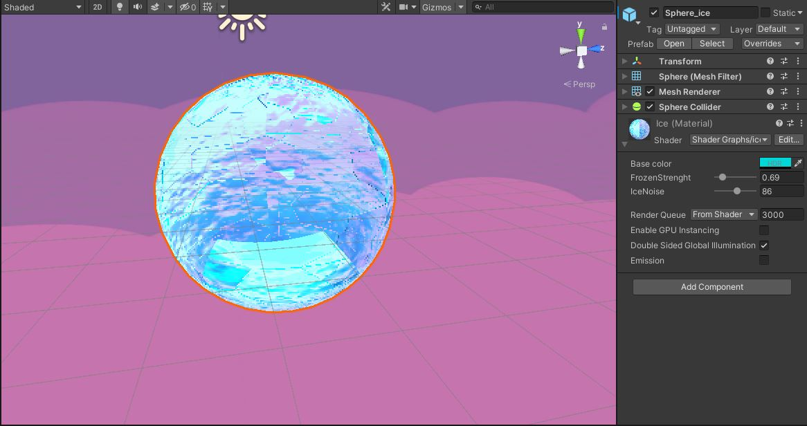
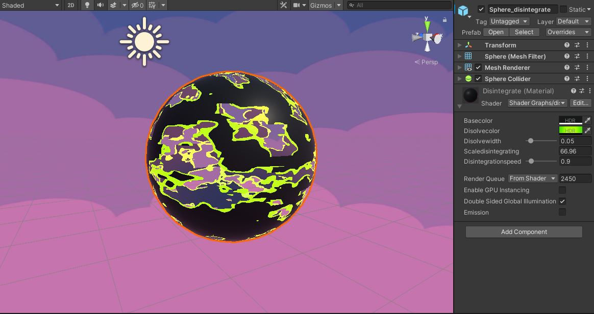
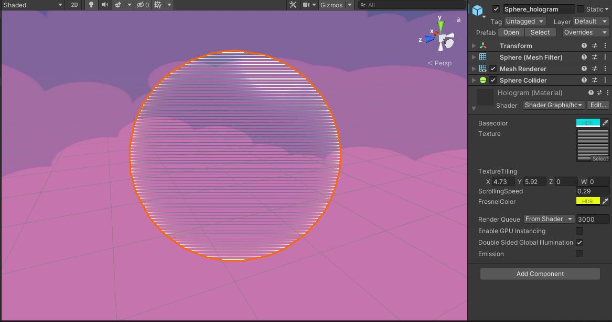
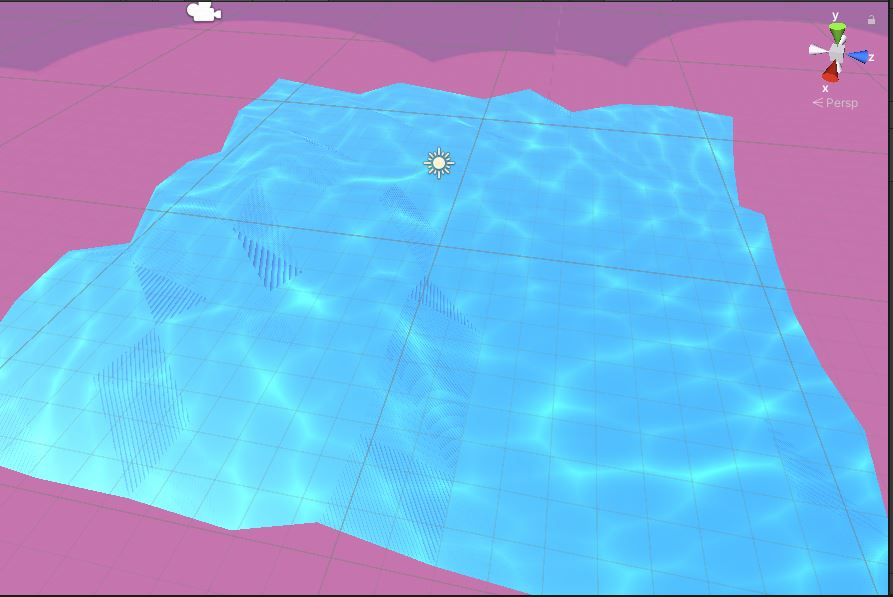

# 0x0D. Unity - ShaderGraph

# Read

<ul>
    <li>Watch: <a href="/rltoken/Es_57ABBf2d2-kgPvBJI-A" title="Shaders 101" target="_blank">Shaders 101</a></li>
    <li><a href="/rltoken/jnTlUA9s8Pbwe4mtENqW0g" title="A Gentle Introduction to Shaders" target="_blank">A Gentle Introduction to Shaders</a></li>
    <li>Watch: <a href="/rltoken/p3u7-3azUJPys8fiwzfIsQ" title="Intro to ShaderGraph" target="_blank">Intro to ShaderGraph</a></li>
    <li><a href="/rltoken/3PB6ND1rMAs6PhssQhg-1w" title="Getting Started with ShaderGraph" target="_blank">Getting Started with ShaderGraph</a></li>
    <li><a href="/rltoken/gWbWnSBIPoCtoIVIVO3k-A" title="ShaderGraph Documentation" target="_blank">ShaderGraph Documentation</a></li>
    <li><a href="/rltoken/x0nJb5BLtH-cryUNsJR9eA" title="Unity Manual: Unity's Rendering Pipeline" target="_blank">Unity Manual: Unity’s Rendering Pipeline</a></li>
    <li><a href="/rltoken/0UZdzhitCm9ROcxdHdEtag" title="Unity Manual: Asset packages" target="_blank">Unity Manual: Asset packages</a></li>
</ul>

<strong>References</strong>

<ul>
    <li><a href="/rltoken/N9-hGoZTZGqLV6v-tzItNg" title="Unity Manual" target="_blank">Unity Manual</a></li>
    <li><a href="/rltoken/Pl_z7WDxyZ64dV1s9Z3PKQ" title="Unity Manual: Material Charts" target="_blank">Unity Manual: Material Charts</a></li>
    <li>Watch: <a href="/rltoken/K-rKPyV9fQBJUhv37FKNZA" title="Shaders Case Studies" target="_blank">Shaders Case Studies</a></li>
</ul>

<h2>What you should learn</h2>
<ul>
    <li>What is rendering</li>
    <li>What is a render pipeline</li>
    <li>What is Unity’s Scriptable Render Pipeline</li>
    <li>What is a shader</li>
    <li>What is ShaderGraph and how is it used</li>
    <li>How to setup a new project that utilizes ShaderGraph</li>
    <li>What is the difference between surface, vertex and fragment shaders</li>
    <li>What is UV mapping</li>
    <li>What is vertex animation</li>
</ul>

## Images

<strong>All Shaders</strong>

<strong>Glow Shader</strong>

<strong>Glow Animate Shader</strong>

<strong>Ice Shader</strong>

<strong>Disolve Shader</strong>

<strong>Hologram Shader</strong>

<strong>Water Shader</strong>

#### Follow me 💬

| Authors | GitHub | Twitter | Linkedin |
| :---: | :---: | :---: | :---: |
| Crispthofer Rincon | [crispthoalex](https://github.com/crispthoalex) | [@crispthoalex](https://twitter.com/crispthoalex) | [carmurrain](https://www.linkedin.com/in/carmurrain) |

### License
*`0x0D. Unity - ShaderGraph` is open source and therefore free to download and use without permission.*

##### Holberton School – Advanced Program – AR/VR
##### October, 2021. Cali, Colombia
