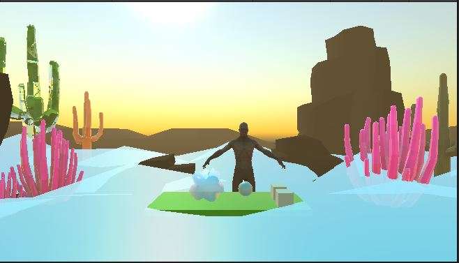

# 0x0E. Unity - WebVR (WebXR)

 

One of the hurdles in the widespread adoption of AR/VR technology is the necessity to download applications or executables to a device in order to experience it. With WebXR, these experiences could be hosted on web pages, making them more accessible to more people.

<h2>Readme</h2>
<ul>
    <li><a href="/rltoken/PXGVKSFrhyNBbAzzs1Ui-A" title="WebGL: 2D and 3D graphics for the web" target="_blank">WebGL: 2D and 3D graphics for the web</a></li>
    <li><a href="/rltoken/crUG2xUN3UpaYjaf43cZQg" title="Unity WebGL Development" target="_blank">Unity WebGL Development</a></li>
    <li><a href="/rltoken/HwtW4hFIUjhP0f_nuBhcAA" title="WebXR Device API" target="_blank">WebXR Device API</a></li>
    <li><a href="/rltoken/_cmSoeb18o8PmDDes7X1oQ" title="WebXR Device API Explained" target="_blank">WebXR Device API Explained</a></li>
    <li><a href="/rltoken/76AbllDY4rLtrTIMgaBjQw" title="Immersive Web" target="_blank">Immersive Web</a></li>
    <li><a href="/rltoken/2ETsQG96bdLrheRJkxw9Qw" title="Immersive Web - WebXR Samples" target="_blank">Immersive Web - WebXR Samples</a></li>
    <li><a href="/rltoken/rBukL6vG66i12xMI_aYMwA" title="Unity WebXR Export" target="_blank">Unity WebXR Export</a></li>
    <li><a href="/rltoken/BEGatcFa7K1UPdv1M22GEw" title="OpenUPM Introduction" target="_blank">OpenUPM Introduction</a></li>
    <li><a href="/rltoken/woSN-wBFOhvOc1vY9bqeyw" title="Github Pages" target="_blank">Github Pages</a></li>
</ul>
 

## Screenshoot

 

## Repository to Deploy
Click here => [WebXRDeploy-HS](https://github.com/CrispthoAlex/WebXRDeploy-HS)

Or *[Try it!!!](https://crispthoalex.github.io/WebXRDeploy-HS/)*

 

#### Follow me 💬

| Author(s) | GitHub | Twitter | Linkedin |
| :---: | :---: | :---: | :---: |
| Crispthofer Rincon | [crispthoalex](https://github.com/crispthoalex) | [@crispthoalex](https://twitter.com/crispthoalex) | [carmurrain](https://www.linkedin.com/in/carmurrain) |

### License
*`0x0E. Unity - WebVR` is open source and therefore free to download and use without permission.*

##### Holberton School  Advanced Program  AR/VR
##### January, 2022. Cali, Colombia